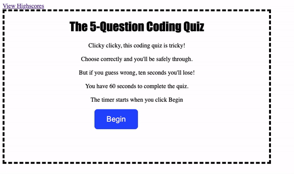

Coding Quiz

Ready to test your JavaScript knowledge? You'll have 60 seconds to answer five multiple-choice questions to prove you've got what it takes. However, when you answer a quesiton wrong, you'll lose ten seconds! The game is over when you answer all five quesitons or run out of time. Then, you'll be prompted to add your initials to the high-score list.

The following gif demonstrates the functionality of my quiz: 

